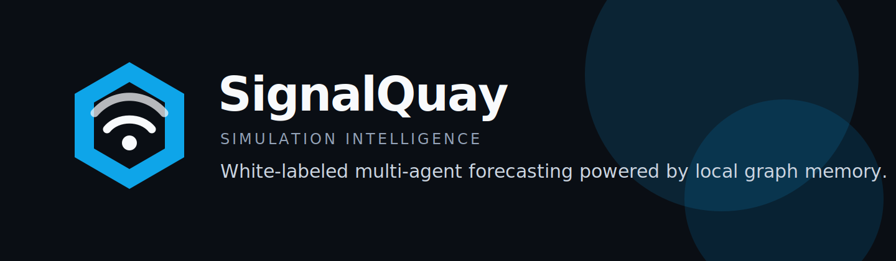
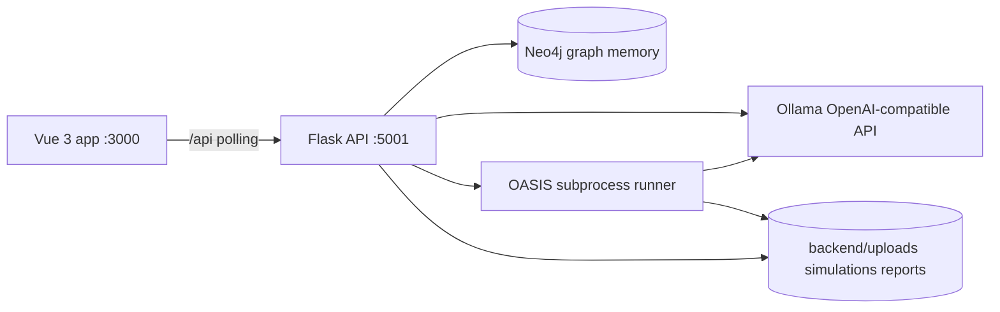

<div align="center">



# SignalQuay Simulation Engine

**White-labeled multi-agent simulation intelligence powered by MiroFish-Offline, Neo4j, OASIS, and local Ollama models.**

SignalQuay turns customer documents, announcements, policy drafts, market news, and strategic changes into a living simulated environment: a knowledge graph, hundreds of agent personas, simulated social activity, analytical reports, and post-run agent interviews.

</div>

## What This Is

SignalQuay is a white-labeled fork of [MiroFish-Offline](https://github.com/nikmcfly/MiroFish-Offline), itself a fully local fork of [MiroFish](https://github.com/666ghj/MiroFish). The engine is designed for local testing first, with a future path toward a hosted customer-facing product.

Core workflow:

1. **Graph Build** - Extract entities, events, organizations, and relationships from uploaded documents into Neo4j.
2. **Environment Setup** - Generate agent personas and simulation configuration from the graph.
3. **Simulation** - Run OASIS agents through simulated social platforms and record posts, comments, and actions.
4. **Report** - Generate structured analysis with graph search, tool use, and agent interviews.
5. **Interaction** - Chat with the Report Agent and interview individual simulated agents.

## Local Quick Start

### Prerequisites

- Docker Desktop with WSL2 backend (recommended full stack), **or** Python 3.11+, Node.js 18+, Neo4j 5.15+, Ollama
- NVIDIA GPU support for Docker if you use GPU-backed Ollama in Compose

Copy [.env.example](.env.example) to `.env` and adjust for your environment. When **all** services run in Docker Compose, uncomment the Docker-mode overrides in `.env.example` so the app container reaches `neo4j` and `ollama` by service name (not `localhost`).

### Run (Docker)

```bash
docker compose up -d
docker exec signalquay-ollama ollama pull qwen2.5:32b
docker exec signalquay-ollama ollama pull nomic-embed-text
```

Open:

- Frontend: `http://localhost:3000`
- Backend health: `http://localhost:5001/health`
- Neo4j Browser: `http://localhost:7474`
- Ollama tags: `http://localhost:11434/api/tags`

Model names, embedding model, and simulation/report limits come from **your** `.env`; defaults in [.env.example](.env.example) and [`backend/app/config.py`](backend/app/config.py) match the upstream MiroFish-Offline recommendations unless you override them.

## Architecture



Important implementation details:

- Flask blueprints live under `/api/graph`, `/api/simulation`, and `/api/report`.
- `GraphStorage` abstracts the graph database; `Neo4jStorage` is the current implementation.
- Simulation runs are subprocess-backed and tracked through files, SQLite databases, and JSONL action logs under `backend/uploads/`.
- The frontend uses Vue 3, Vite, vue-router, axios, and D3. There is no auth, i18n, Pinia, WebSocket layer, or SaaS tenancy yet.
- The app currently uses HTTP polling for live status.

**Branding-only changes** (SignalQuay UI, assets, container names, docs) do not alter the simulation algorithm, OASIS integration, or graph logic. Runtime behavior is unchanged unless you change environment variables or code under `backend/app/services/`, `backend/scripts/`, etc.

## White-Label Structure

SignalQuay branding is centralized in:

- `frontend/src/brand/index.js`
- `frontend/src/components/AppHeader.vue`
- `frontend/src/App.vue` CSS variables
- `frontend/src/assets/logo/signalquay_logo_left.svg`
- `frontend/public/signalquay-icon.svg`

## Hardware And Models

Authoritative **RAM / VRAM tiers and recommended models** for this engine are documented in [ROADMAP.md](ROADMAP.md) (Hardware Tiers section). Use that file when sizing a deployment; do not treat ad-hoc notes in other docs as replacing it.

## Attribution And License

This repository is a modified white-labeled fork of [MiroFish-Offline](https://github.com/nikmcfly/MiroFish-Offline), which is based on [MiroFish](https://github.com/666ghj/MiroFish). The simulation engine uses [OASIS](https://github.com/camel-ai/oasis) from the CAMEL-AI team.

The project is licensed under AGPL-3.0. Because AGPL includes network-use obligations, hosted SaaS modifications may need to be published. Confirm obligations with counsel before commercial deployment.
